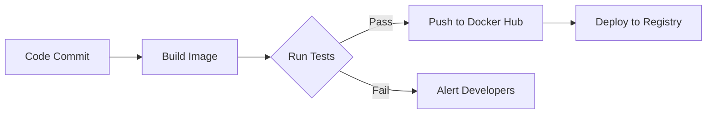

# Docker Guide

## 🐳 Getting Started

### Prerequisites
- [Docker](https://docs.docker.com/get-docker/) installed
- Basic familiarity with Docker commands

## Image Variants

| Tag         | Description                     | Base Image       |
|-------------|---------------------------------|------------------|
| `latest`    | Production-optimized image      | `python:3.9-slim`|
| `dev`       | Development tools included      | `python:3.9`     |
| `alpine`    | Minimal Alpine Linux version    | `python:3.9-alpine` |

## Usage Examples

=== "Basic Run"
    ```bash
    docker run -it --rm arupravy/hello-trading
    ```

=== "Custom Strategy"
    ```bash
    docker run -e STRATEGY=advanced arupravy/hello-trading
    ```

=== "Persistent Data"
    ```bash
    docker run -v ./data:/app/data arupravy/hello-trading
    ```

## Image Security

```bash
# Scan for vulnerabilities
docker scan arupravy/hello-trading

# Verify signatures
docker trust inspect arupravy/hello-trading
```

## CI/CD Pipeline



## Multi-stage Build

```dockerfile
# Build stage
FROM python:3.9 as builder
COPY requirements.txt .
RUN pip wheel --no-cache-dir --no-deps --wheel-dir /wheels -r requirements.txt

# Final stage
FROM python:3.9-slim
COPY --from=builder /wheels /wheels
RUN pip install --no-cache /wheels/*
COPY . /app
WORKDIR /app
CMD ["python", "src/main.py"]
```