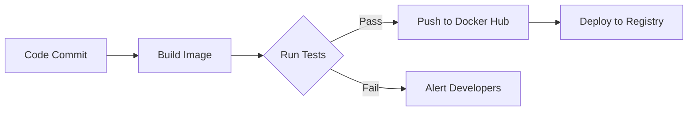

# Hello Trading Documentation

Welcome to the documentation for the Hello Trading project!

## 🐳 Docker Integration

## Pre-built Images
[](https://hub.docker.com/r/arupravy/hello-trading)
[](https://hub.docker.com/r/arupravy/hello-trading)

### Official Images
```dockerfile
# Production image
FROM arupravy/hello-trading:latest

# Development image (with debug tools)
FROM arupravy/hello-trading:dev
```

### Runtime Configuration
``` yaml
# Example docker-compose.yml
version: '3.8'

services:
  trading-sim:
    image: arupravy/hello-trading:latest
    ports:
      - "5000:5000"
    environment:
      - TRADING_STRATEGY=basic
      - LOG_LEVEL=INFO
    volumes:
      - ./config:/app/config
```
### Image Variants

| Tag       | Description                      | Base Image           |
|-----------|----------------------------------|----------------------|
| `latest`  | Production-optimized image       | `python:3.9-slim`    |
| `dev`     | Development tools included       | `python:3.9`         |
| `alpine`  | Minimal Alpine Linux version     | `python:3.9-alpine`  |

### Multi-stage Build
```dockerfile
# Build stage
FROM python:3.9 as builder

COPY requirements.txt .
RUN pip wheel --no-cache-dir --no-deps --wheel-dir /wheels -r requirements.txt

# Final stage
FROM python:3.9-slim

COPY --from=builder /wheels /wheels
RUN pip install --no-cache /wheels/*
COPY . /app
WORKDIR /app

CMD ["python", "src/main.py"]
```
### CI/CD Pipeline


### 🛠 Usage Examples

=== "Basic Run"
    ```bash
    docker run -it --rm arupravy/hello-trading
    ```

=== "Custom Strategy"
    ```bash
    docker run -e STRATEGY=advanced arupravy/hello-trading
    ```

=== "Persistent Data"
    ```bash
    docker run -v ./data:/app/data arupravy/hello-trading
    ```

### 🔒 Image Security

```bash
# Scan image for vulnerabilities
docker scan arupravy/hello-trading

# Verify image signatures
docker trust inspect arupravy/hello-trading
```

## Features
- Basic trading simulation
- Docker support
- CI/CD pipeline

### Verification Checklist
1. Ensure `mkdocs.yml` includes:
   ```yaml
   plugins:
     - mermaid2
   markdown_extensions:
     - pymdownx.tabbed
     - pymdownx.superfences